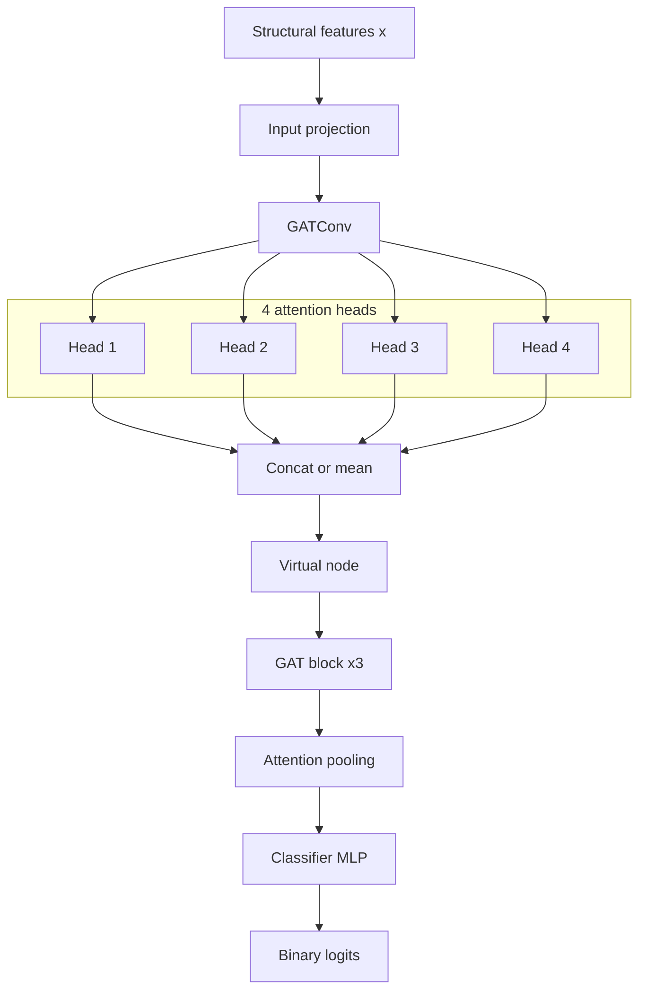
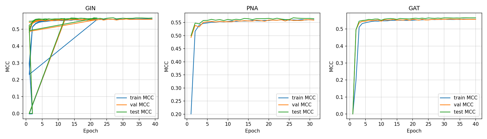
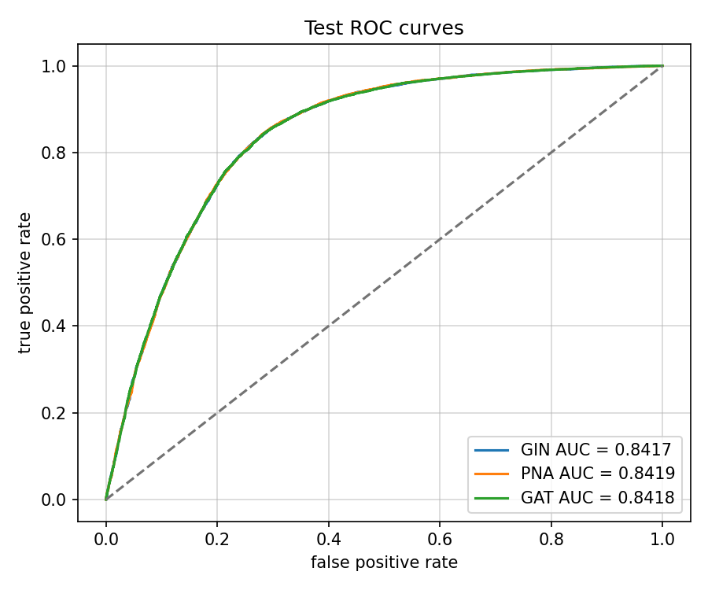
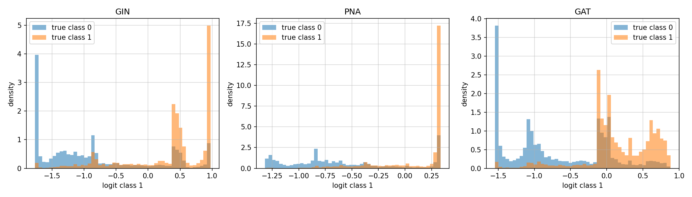
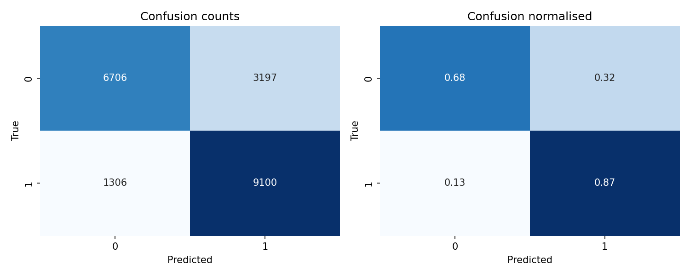
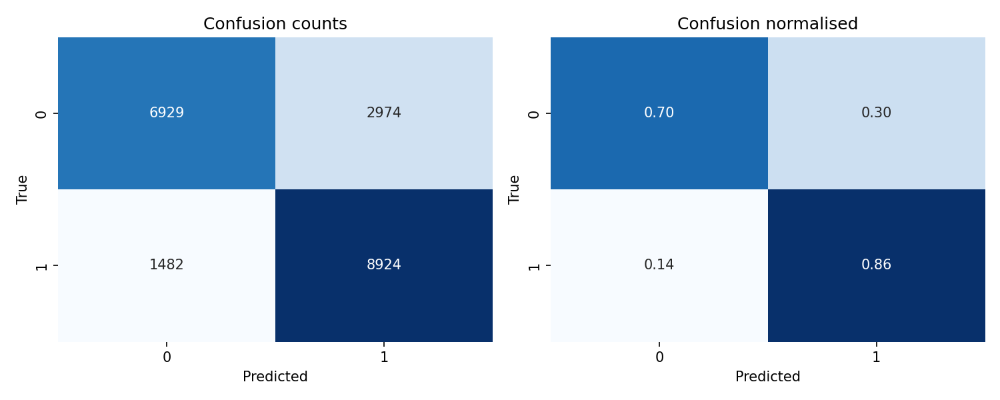

# Graph Classification on SNAP Reddit Threads

End-to-end graph classification on the [SNAP Reddit Threads](https://snap.stanford.edu/data/reddit_threads.html) dataset with PyTorch Geometric. Three encoders are compared under an identical protocol: GIN, PNA, and GAT. Model selection uses validation Matthews correlation coefficient. Structural node features are engineered because the dataset provides no raw node attributes.

## Dataset

The source is [SNAP Reddit Threads](https://snap.stanford.edu/data/reddit_threads.html). The graphs were collected in **May 2018**. Nodes are Reddit users who participate in a thread. Undirected edges are reply relations between users. The task is binary graph classification: predict whether a thread is discussion-based.

| Property | Value |
|---|---|
| Number of graphs | 203,088 |
| Directed | No |
| Node features | No |
| Edge features | No |
| Graph labels | Binary |
| Temporal | No |
| Nodes per graph | 11–97 |
| Density | 0.021–0.382 |
| Diameter | 2–27 |

Raw files:

- `reddit_target.csv` with columns `id`, `target`
- `reddit_edges.json` mapping graph id to edge lists

## Repository structure

```
threads-gnn/
├── configs/default.yaml
├── .env.example
├── scripts/install.sh
├── scripts/push_github.sh
├── data/
├── features/
├── models/
├── training/
├── scripts/
├── schemas.py
└── main.py
```

## Google Colab

Open a terminal in Colab and run the commands below.

### Clone

```bash
git clone https://github.com/pymlex/threads-gnn.git
cd threads-gnn
```

### Install

Creates `.env` from `.env.example`, reinstalls PyG wheels matched to the Colab PyTorch build, and verifies `torch-scatter`. GitHub authentication runs only when `gh` is not already logged in.

```bash
bash scripts/install.sh
```

Edit `.env` and set `HF_TOKEN`. Optional fields: `GITHUB_NAME`, `GITHUB_EMAIL`.

### Preprocess

Downloads SNAP data and builds sharded processed graphs with structural features.

```bash
python scripts/preprocess.py --config configs/default.yaml
```

| Argument | Default | Description |
|---|---|---|
| `--config` | `configs/default.yaml` | Experiment configuration path |

### Train

Trains GIN, PNA, and GAT by default with identical splits and hyperparameters.

```bash
python scripts/train.py --config configs/default.yaml
```

| Argument | Default | Description |
|---|---|---|
| `--config` | `configs/default.yaml` | Experiment configuration path |
| `--architecture` | `all` | `all`, `gin`, `pna`, or `gat` |
| `--pooling` | from config | `mean`, `sum`, or `attention` |

### Compare architectures

Ranks models by validation MCC and writes `runs/selected_model.json`.

```bash
python scripts/compare.py
```

| Argument | Default | Description |
|---|---|---|
| `--runs-dir` | `runs` | Directory with run outputs |
| `--seed` | `42` | Random seed in run folder names |

### Evaluate

Evaluates all best checkpoints on the test split by default.

```bash
python scripts/eval.py --config configs/default.yaml
```

| Argument | Default | Description |
|---|---|---|
| `--config` | `configs/default.yaml` | Experiment configuration path |
| `--architecture` | `all` | `all`, `gin`, `pna`, or `gat` |
| `--checkpoint` | auto | Path for a single-architecture run |
| `--split` | `test` | `train`, `val`, or `test` |
| `--seed` | `42` | Seed used in checkpoint filenames |

### Plot training curves

```bash
python scripts/plot_curves.py
```

| Argument | Default | Description |
|---|---|---|
| `--runs-dir` | `runs` | Directory with epoch metrics |
| `--seed` | `42` | Random seed in run folder names |

### Plot logit histograms and ROC curves

Loads best checkpoints, runs inference on the test split, and writes logit histograms plus ROC curves.

```bash
python scripts/plot_diagnostics.py --config configs/default.yaml
```

| Argument | Default | Description |
|---|---|---|
| `--config` | `configs/default.yaml` | Experiment configuration path |
| `--runs-dir` | `runs` | Directory for figure output |
| `--checkpoints-dir` | `checkpoints` | Checkpoint directory |
| `--split` | `test` | `train`, `val`, or `test` |
| `--seed` | `42` | Random seed in checkpoint filenames |

### Push results to GitHub

Aggregates metrics, writes comparison tables and training curves, then commits and pushes `runs/` artefacts to the repository.

```bash
bash scripts/push_github.sh
```

| Argument | Default | Description |
|---|---|---|
| seed | `42` | Random seed in run folder names |

Tracked files: `architecture_comparison.csv`, `selected_model.json`, `training_curves.png`, per-architecture `epoch_metrics.csv`, `final_metrics.json`, confusion matrices, classification reports, and test predictions. Checkpoints remain local and are uploaded to Hugging Face separately.

### Full pipeline

```bash
python scripts/run_all.py --config configs/default.yaml
```

| Argument | Default | Description |
|---|---|---|
| `--config` | `configs/default.yaml` | Experiment configuration path |

### Push to Hugging Face

Reads `HF_TOKEN` from `.env`. Uploads the selected GIN checkpoint and `model_card.md`.

```bash
python scripts/push_hf.py --repo-id pymlex/threads-gnn
```

| Argument | Default | Description |
|---|---|---|
| `--repo-id` | `pymlex/threads-gnn` | Hugging Face model repository |
| `--runs-dir` | `runs` | Directory with experiment outputs |
| `--checkpoints-dir` | `checkpoints` | Checkpoint directory |
| `--seed` | `42` | Random seed in checkpoint filenames |

## Structural node features

Because the dataset has no node features, each graph receives engineered structural descriptors controlled by `FeatureConfig` in `schemas.py`. All features are enabled by default. The exact configuration is saved to `data/processed/feature_config.json` during preprocessing.

For a graph $G = (V, E)$ with $n = |V|$ nodes and adjacency matrix $A$, node $i$ receives the following descriptors when enabled.

**Degree**

$$d_i = \sum_{j=1}^{n} A_{ij}$$

**Log degree**

$$\log(1 + d_i)$$

**Normalised degree**

$$\tilde{d}_i = \frac{d_i}{\max_{k \in V} d_k}$$

**Degree bucket embedding**

One-hot encoding of $d_i$ over $B$ uniform bins on $[0, \max_k d_k]$.

**Clustering coefficient**

$$c_i = \frac{2|T_i|}{d_i(d_i - 1)}$$

where $T_i$ is the set of triangles containing node $i$.

**K-core number**

The core number $\kappa_i$ from the $k$-core decomposition, normalised by $\max_k \kappa_k$.

**PageRank**

$$\mathbf{pr} = \alpha \mathbf{P}^{\top} \mathbf{pr} + (1 - \alpha)\frac{\mathbf{1}}{n}$$

with $\alpha = 0.85$.

**Laplacian positional encodings**

Let $L = I - D^{-1/2} A D^{-1/2}$ be the normalised Laplacian. The smallest $k$ non-trivial eigenvectors of $L$ form an $n \times k$ matrix used as positional encodings.

**Random-walk structural encodings**

Let $P = D^{-1}A$ be the random-walk transition matrix and $R^{(t)} = P^t$. The diagonal entries $R^{(t)}_{ii}$ for $t = 1, \ldots, T$ form RWSE features.

With the default configuration, the input dimension is $38$.

## Graph encoders

Three graph encoders are compared under an identical protocol: $L = 4$ message-passing layers, hidden dimension $d = 128$, dropout $0.2$, attention pooling, virtual node, and a shared classifier head. Each encoder maps structural node features $\mathbf{x}_i \in \mathbb{R}^{38}$ to graph-level logits.

**Shared input projection**

$$\mathbf{h}_i^{(0)} = \mathrm{Dropout}\left(\mathrm{LayerNorm}\left(\mathrm{ReLU}\left(\mathbf{W}_{\text{in}}\mathbf{x}_i + \mathbf{b}_{\text{in}}\right)\right)\right)$$

**Shared virtual node update** after every encoder layer. For graph $g$ with node set $V_g$ and batch index $b(i)$:

$$\mathbf{v}_g \leftarrow \mathrm{MLP}\left(\mathbf{v}_g + \sum_{i \in V_g} \mathbf{h}_i\right), \qquad \mathbf{h}_i \leftarrow \mathbf{h}_i + \mathbf{v}_{b(i)}$$

**Shared classifier head** on the pooled graph embedding $\mathbf{g}$:

$$\hat{\mathbf{y}} = \mathbf{W}_{\text{out}}\,\mathrm{Dropout}\left(\mathrm{LayerNorm}\left(\mathrm{ReLU}\left(\mathbf{W}_1 \mathbf{g} + \mathbf{b}_1\right)\right)\right) + \mathbf{b}_{\text{out}}$$

### GIN

Graph Isomorphism Network treats neighbourhood aggregation as an injective multiset function. For layer $\ell$, MLP $\phi_{\Theta}$ and neighbourhood $\mathcal{N}(i)$:

$$\mathbf{u}_i^{(\ell)} = (1 + \varepsilon)\,\mathbf{h}_i^{(\ell)} + \sum_{j \in \mathcal{N}(i)} \mathbf{h}_j^{(\ell)}$$

$$\tilde{\mathbf{h}}_i^{(\ell+1)} = \phi_{\Theta}\left(\mathbf{u}_i^{(\ell)}\right), \qquad \mathbf{h}_i^{(\ell+1)} = \mathbf{h}_i^{(\ell)} + \mathrm{Dropout}\left(\mathrm{ReLU}\left(\mathrm{LayerNorm}\left(\tilde{\mathbf{h}}_i^{(\ell+1)}\right)\right)\right)$$

With $\varepsilon = 0$ and a two-layer perceptron inside $\phi_{\Theta}$, GIN is the strongest classical Weisfeiler–Lehman discriminator among the three encoders. It does not assign edge-specific weights: every neighbour enters the sum with unit coefficient before the MLP.

```mermaid
flowchart TB
    X["Structural features x"] --> Proj["Input projection"]
    Proj --> GIN["GINConv + MLP"]
    GIN --> Res["Residual + LayerNorm"]
    Res --> VN["Virtual node pool-broadcast"]
    VN --> GIN2["GIN block x3"]
    GIN2 --> Pool["Attention pooling"]
    Pool --> Head["Classifier MLP"]
    Head --> Out["Binary logits"]
    GIN --> Sum["Neighbour sum"]
    Sum --> GIN
````

### PNA

Principal Neighbourhood Aggregation keeps multiple statistics over each neighbourhood and rescales them by node degree. Let $h_i^{(\ell)}$ be the centre embedding and $h_{ij} = h_{\Theta}(h_i^{(\ell)}, h_j^{(\ell)})$ the message from neighbour $j$.

$$\mu_i = \frac{1}{|\mathcal{N}(i)|}\sum_{j \in \mathcal{N}(i)} \mathbf{h}*{ij}, \quad m_i = \max*{j \in \mathcal{N}(i)} \mathbf{h}_{ij}$$

$$\underline{m}*i = \min*{j \in \mathcal{N}(i)} \mathbf{h}*{ij}, \quad \sigma_i = \sqrt{\frac{1}{|\mathcal{N}(i)|}\sum*{j \in \mathcal{N}(i)} \left(\mathbf{h}_{ij} - \mu_i\right)^{\odot 2}}$$

Degree scalers $s \in {\text{identity}, \text{amplification}, \text{attenuation}}$ are applied to each statistic using the training-split degree histogram. The aggregated message is passed through $\gamma_{\Theta}$ and the same residual block as GIN. PNA is the most expressive encoder in this comparison because it separates mean trend, extremal neighbours, and local dispersion.

```mermaid
flowchart TB
    X["Structural features x"] --> Proj["Input projection"]
    Proj --> PNA["PNAConv"]
    subgraph Agg["Neighbourhood statistics"]
        M["mean"]
        MX["max"]
        MN["min"]
        SD["std"]
    end
    PNA --> M
    PNA --> MX
    PNA --> MN
    PNA --> SD
    M --> Sc["Degree scalers"]
    MX --> Sc
    MN --> Sc
    SD --> Sc
    Sc --> VN["Virtual node"]
    VN --> PNA2["PNA block x3"]
    PNA2 --> Pool["Attention pooling"]
    Pool --> Head["Classifier MLP"]
    Head --> Out["Binary logits"]
```

### GAT

Graph Attention Network assigns a data-dependent weight to every edge. For head $k$ at layer $\ell$:

$$e_{ij}^{(k)} = \mathrm{LeakyReLU}\left({\mathbf{a}^{(k)}}^{\top}\left[\mathbf{W}^{(k)}\mathbf{h}_i^{(\ell)} ,|, \mathbf{W}^{(k)}\mathbf{h}_j^{(\ell)}\right]\right)$$

$$\alpha_{ij}^{(k)} = \frac{\exp\left(e_{ij}^{(k)}\right)}{\sum_{u \in \mathcal{N}(i)\cup{i}} \exp\left(e_{iu}^{(k)}\right)}$$

$$\mathbf{h}*i^{(\ell+1,k)} = \sum*{j \in \mathcal{N}(i)\cup{i}} \alpha_{ij}^{(k)},\mathbf{W}^{(k)}\mathbf{h}_j^{(\ell)}$$

Layers $1$–$3$ concatenate $K = 4$ heads. The final layer averages head outputs so that $\mathbf{h}_i^{(L)} \in \mathbb{R}^{d}$. Residual connection, LayerNorm, and ELU activation follow each attention block. GAT is the only encoder that learns neighbour-specific coefficients at inference time.



## Graph-level pooling

Three pooling operators are implemented.

**Global mean pooling**

$$\mathbf{g} = \frac{1}{|V|}\sum_{i \in V} \mathbf{h}_i$$

**Global sum pooling**

$$\mathbf{g} = \sum_{i \in V} \mathbf{h}_i$$

**Attention pooling**

$$s_i = \mathbf{w}^{\top}\tanh(\mathbf{W}\mathbf{h}_i), \qquad \alpha_i = \frac{\exp(s_i)}{\sum_{j \in V}\exp(s_j)}, \qquad \mathbf{g} = \sum_{i \in V} \alpha_i \mathbf{h}_i$$

All three architectures use the same pooling method from `configs/default.yaml`.

## Training protocol

- stratified train, validation, and test split with ratios $0.8 / 0.1 / 0.1$
- random seed $42$
- AdamW optimiser with learning rate $3 \times 10^{-3}$ and weight decay $10^{-4}$
- cosine learning-rate schedule over $40$ epochs
- full-precision training on GPU
- gradient clipping with max norm $1.0$
- early stopping on validation MCC with patience $8$
- batch size $4096$

The test split is never used for model selection. Architectures are ranked by best validation MCC. Test metrics for the selected architecture are reported once after training.

Per-epoch metrics are logged with `tqdm` and saved to `runs/<architecture>_seed42/epoch_metrics.csv`. Final metrics are saved to `runs/<architecture>_seed42/final_metrics.json`.

### Primary metrics

Matthews correlation coefficient:

$$\mathrm{MCC} = \frac{TP \cdot TN - FP \cdot FN}{\sqrt{(TP+FP)(TP+FN)(TN+FP)(TN+FN)}}$$

Additional metrics: accuracy, balanced accuracy, precision, recall, F1, ROC-AUC, PR-AUC, confusion matrix, classification report.

## Results

Experiments use seed $42$, batch size $4096$, learning rate $3 \times 10^{-3}$, and early stopping on validation MCC. Model selection ranks architectures by best validation MCC only.

### Architecture comparison

| Architecture | Best val MCC | Val F1 | Val ROC-AUC | Test MCC | Test F1 | Test ROC-AUC |
|---|---:|---:|---:|---:|---:|---:|
| GIN | 0.5609 | 0.7998 | 0.8414 | 0.5642 | 0.8017 | 0.8417 |
| PNA | 0.5609 | 0.8001 | 0.8414 | 0.5635 | 0.8016 | 0.8419 |
| GAT | 0.5592 | 0.7971 | 0.8416 | 0.5655 | 0.8002 | 0.8418 |

**GIN** is selected with validation MCC $0.5609$, ahead of PNA by $6 \times 10^{-5}$ and ahead of GAT by $1.7 \times 10^{-3}$. On the held-out test split the ranking shifts slightly: GAT reaches the highest test MCC $0.5655$, followed by GIN $0.5642$ and PNA $0.5635$. ROC-AUC is stable across encoders at $0.841$–$0.842$, so the three models preserve nearly the same ranking quality while differing mainly in the class-wise error trade-off.

### Training dynamics

Validation MCC rises sharply in the first five epochs and plateaus near $0.55$–$0.56$ for every encoder. Best checkpoints appear at epoch $31$ for GIN, epoch $23$ for PNA, and epoch $32$ for GAT. PNA stops after $31$ epochs, GAT after $40$, and GIN after early stopping once validation MCC fails to improve for eight consecutive epochs.



### ROC curves and logit histograms



The three ROC curves overlap almost completely. Test ROC-AUC values are 0.8417 for GIN, 0.8419 for PNA, and 0.8418 for GAT. All models reach true positive rate 0.80 near false positive rate 0.25, then flatten toward the upper-right corner. Ranking quality is therefore encoder-invariant on this split: differences between architectures appear only after fixing a decision threshold, not in the order of predicted scores.



Histograms plot the class-1 logit on the test split, split by ground-truth label.

**GIN** forms two well-separated modes. True class $0$ concentrates below $-0.5$, with a dominant spike near $-1.75$. True class $1$ concentrates above $0.4$, with a sharp spike near $1.0$ and a secondary mode near $0.5$. Median positive-class probability is $0.815$ for true class $1$ and $0.189$ for true class $0$. At threshold $0.5$, $32.3\%$ of class-$0$ graphs are false positives and $12.6\%$ of class-$1$ graphs are false negatives.

**PNA** compresses the positive mode into a narrow spike near logit $0.3$, while the class-$0$ density spreads across negative logits without a single sharp peak. Median probabilities are $0.805$ for class $1$ and $0.217$ for class $0$. The ranking AUC matches GIN, but the logit scale is less dispersed: PNA acts as a near-saturated scorer on positive threads.

**GAT** shows the widest overlap between classes. True class $0$ retains mass below $-1.0$, yet true class $1$ also places a mode near logit $0$, so the decision boundary is less sharp than in GIN. GAT yields the lowest false-positive rate on class $0$ at $30.0\%$, but the highest false-negative rate on class $1$ at $14.2\%$. This pattern matches the confusion matrices: GAT sacrifices positive recall to recover more negative-class graphs.

Per-architecture figures: `runs/gin_seed42/test_roc_curve.png`, `runs/pna_seed42/test_roc_curve.png`, `runs/gat_seed42/test_roc_curve.png`, and the matching `test_logit_histogram.png` files.

### Confusion matrices

All models favour recall on the positive class. Class $0$ recall stays near $0.67$–$0.70$ while class $1$ recall exceeds $0.85$. GAT yields the highest class-$0$ recall $0.700$ and the highest test accuracy $0.781$, at the price of the lowest positive-class recall $0.858$ among the three encoders.






### Selected model: GIN

Test metrics for the checkpoint with best validation MCC:

| Metric | Value |
|---|---:|
| MCC | 0.5642 |
| Accuracy | 0.7783 |
| Balanced accuracy | 0.7758 |
| Precision | 0.7400 |
| Recall | 0.8745 |
| F1 | 0.8017 |
| ROC-AUC | 0.8417 |
| PR-AUC | 0.8087 |

Test confusion counts:

|  | Pred 0 | Pred 1 |
|---|---:|---:|
| True 0 | 6706 | 3197 |
| True 1 | 1306 | 9100 |

On this dataset the choice of graph encoder has a small effect once structural features, virtual node, and attention pooling are fixed. GIN wins model selection by validation MCC, yet none of the three encoders separates on ROC-AUC. Logit histograms explain the residual gap: GIN and PNA sharpen the score distribution, while GAT keeps more mass near the boundary and shifts the precision-recall trade-off toward class $0$. PNA ranks first on ROC-AUC by a margin of $2 \times 10^{-4}$ but does not win validation MCC because thresholded metrics react to the saturated positive logits.

## Model weights

Best checkpoint: [pymlex/threads-gnn](https://huggingface.co/pymlex/threads-gnn)

```python
from huggingface_hub import hf_hub_download
import torch

checkpoint_path = hf_hub_download(repo_id="pymlex/threads-gnn", filename="model.pt")
checkpoint = torch.load(checkpoint_path, map_location="cpu", weights_only=False)
```

## Default hyperparameters

| Parameter | Value |
|---|---|
| hidden_dim | 128 |
| num_layers | 4 |
| dropout | 0.2 |
| num_heads | 4 |
| batch_size | 4096 |
| learning_rate | $3 \times 10^{-3}$ |
| num_epochs | 40 |
| weight_decay | $10^{-4}$ |
| early_stopping_patience | 8 |
| virtual_node | enabled |
| pooling | attention |

## References

```bibtex
@misc{threads_gnn,
  author = {Alex Zyukov},
  title = {Graph Classification on SNAP Reddit Threads},
  year = {2026},
  publisher = {GitHub},
  howpublished = {\url{https://github.com/pymlex/threads-gnn}},
}
```

The project is under GPL-3.0 license.

```bibtex
@inproceedings{karateclub,
  title = {{Karate Club: An API Oriented Open-source Python Framework for Unsupervised Learning on Graphs}},
  author = {Benedek Rozemberczki and Oliver Kiss and Rik Sarkar},
  year = {2020},
  pages = {3125--3132},
  booktitle = {Proceedings of the 29th ACM International Conference on Information and Knowledge Management (CIKM '20)},
  organization = {ACM},
}
@inproceedings{xu2019gin,
  title = {How Powerful are Graph Neural Networks?},
  author = {Keyulu Xu and Weihua Hu and Jure Leskovec and Stefanie Jegelka},
  booktitle = {International Conference on Learning Representations},
  year = {2019},
}
@inproceedings{corso2020pna,
  title = {Principal Neighbourhood Aggregation for Graph Nets},
  author = {Gabriele Corso and Luca Cavalleri and Dominique Beaini and Pietro Li and Petar Velickovic},
  booktitle = {Advances in Neural Information Processing Systems},
  year = {2020},
}
@inproceedings{velickovic2018gat,
  title = {Graph Attention Networks},
  author = {Petar Velickovic and Guillem Cucurull and Arantxa Casanova and Adriana Romero and Pietro Li and Yoshua Bengio},
  booktitle = {International Conference on Learning Representations},
  year = {2018},
}
```
